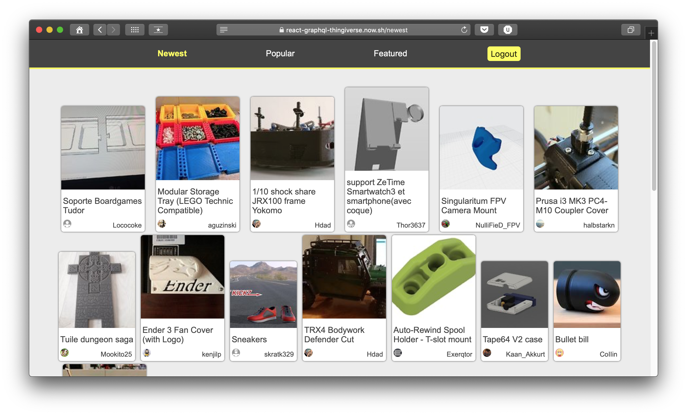

# Thingiverse  showcase (Graphql + React) 🚀

You must have a Thingiverse account... don't worry, I can`t see any personal info.

- Graphql API (Thingiverse REST wrapper) on the back. [ℹ️ info](https://graphql.org/)
- React on the front (responsive enough). [ℹ️ info](https://reactjs.org/)
- Parcel as bundler. [ℹ️ info](http://parceljs.org)
- Typescript everywhere. [ℹ️ info](https://www.typescriptlang.org/)

